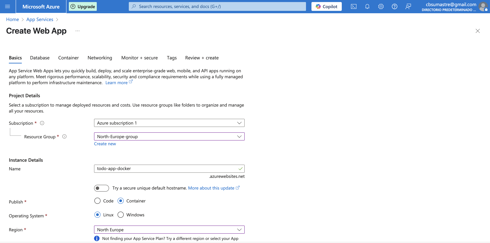

# Master Front End XVII - Módulo 7 - Cloud - Laboratorio

## Modulo Cloud - Laboratorio

### Opcional

Desplegar la app en Azure, usando Docker y Github Actions.


### Para poder desplegar en Azure usando Docker:

- Configurar un App Services (Web App)
  
  

  - Crear PAT (Personal Access Token) en Github para que Azure pueda descargarse la imagen Docker
  


  - Configurar las variables de entorno en Azure


- Habilitar autenticación básica en Azure


- Descargar fichero **Download publish profile** en Azure y usarlo como valor de la secret *AZURE_PUBLISH_PROFILE*

 - Crear secretos en Github para poder desplegar en Azure
 
 


- Crear una Github Actions

```yaml
name: CD Workflow

on:
  push:
    branches:
      - main

env:
  IMAGE_NAME: ghcr.io/${{github.repository}}:${{github.run_number}}-${{github.run_attempt}}

permissions:
  contents: read
  packages: write

jobs:
  cd:
    runs-on: ubuntu-latest
    steps:
      - name: Checkout repository
        uses: actions/checkout@v4

      - name: Log in to Github container registry
        uses: docker/login-action@v3
        with:
          registry: ghcr.io
          username: ${{ github.actor }}
          password: ${{ secrets.GITHUB_TOKEN }}

      - name: Build and push docker image
        run: |
          docker build -t ${{ env.IMAGE_NAME}} .
          docker push ${{ env.IMAGE_NAME}}

      - name: Deploy to Azure
        uses: azure/webapps-deploy@v3
        with:
          app-name: ${{ secrets.AZURE_APP_NAME }}
          publish-profile: ${{ secrets.AZURE_PUBLISH_PROFILE }}
          images: ${{ env.IMAGE_NAME}}
```


- Aplicación desplegada con Dockerfile + Github Actions + Azure:
  [https://todo-app-docker.azurewebsites.net/](https://todo-app-docker.azurewebsites.net/)
